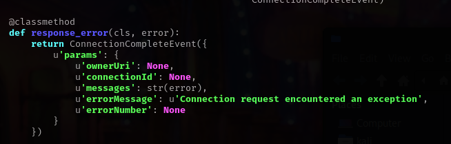

# README: Resolving mssql-cli Installation and Connection Issues

## Introduction

This README provides step-by-step instructions for installing and configuring mssql-cli, a command-line tool for SQL Server, to address common issues and ensure a smooth setup. **DO NOT RUN ANY OF THESE IN ROOT OR SUDO**

## Installation

To install mssql-cli, follow the steps below:

```bash
pip install mssql-cli
export PATH=$PATH:~/.local/bin
```

## Connection Setup

Connect to SQL Server using mssql-cli with the following commands:

```bash
mssql-cli -S 10.0.10.201 -U sa -P Password1
cat ~/.local/bin/mssql-cli
sed -i 's/python/python3/g' ~/.local/bin/mssql-cli
cat ~/.local/bin/mssql-cli
mssql-cli -S 10.0.10.201 -U sa -P Password1
```

## Update cli-helpers

Ensure cli-helpers is upgraded to the latest version:

```bash
pip install cli-helpers --upgrade --force
```

## Resolve Connection Issue

If encountering issues related to connectionservice.py, perform the following steps:

```bash
nano ~/.local/lib/python3.11/site-packages/mssqlcli/jsonrpc/contracts/connectionservice.py
```

Remove references to ownerUri on lines 22 in the connectionservice.py file. After making these changes, the file should look like this:


Address libssl Error
If encountering an error regarding libssl, use the following commands to resolve it:

```bash
wget http://archive.ubuntu.com/ubuntu/pool/main/o/openssl1.0/libssl1.0.0_1.0.2n-1ubuntu5_amd64.deb
sudo dpkg -i libssl1.0.0_1.0.2n-1ubuntu5_amd64.deb
```

Test the connection again:

```bash
mssql-cli -S 10.0.10.201 -U sa -P Password1
```

If you encounter another error, set the DOTNET_SYSTEM_GLOBALIZATION_INVARIANT variable:

````Couldn't find a valid ICU package installed on the system. Set the configuration flag System.Globalization.Invariant to true if you want to run with no globalization support.

   at System.Environment.FailFast(System.String)
   at System.Globalization.GlobalizationMode.GetGlobalizationInvariantMode()
   at System.Globalization.GlobalizationMode..cctor()
   at System.Globalization.CultureData.CreateCultureWithInvariantData()
   at System.Globalization.CultureData.get_Invariant()
   at System.Globalization.CultureInfo..cctor()
   at System.StringComparer..cctor()
   at System.AppDomain.InitializeCompatibilityFlags()
   at System.AppDomain.Setup(System.Object)
Error message: Connection request encountered an exception```


```bash
export DOTNET_SYSTEM_GLOBALIZATION_INVARIANT=true
````

Attempt the connection once more:

```bash
mssql-cli -S 10.0.10.201 -U sa -P Password1
```

The issues should now be resolved, and you can use mssql-cli to interact with SQL Server successfully.
